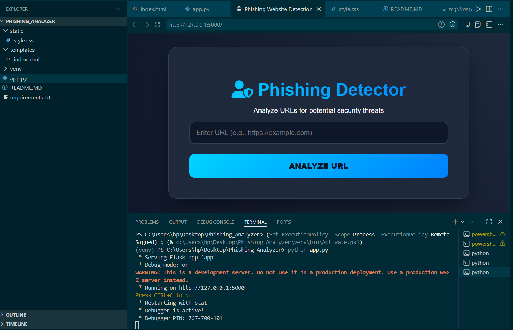
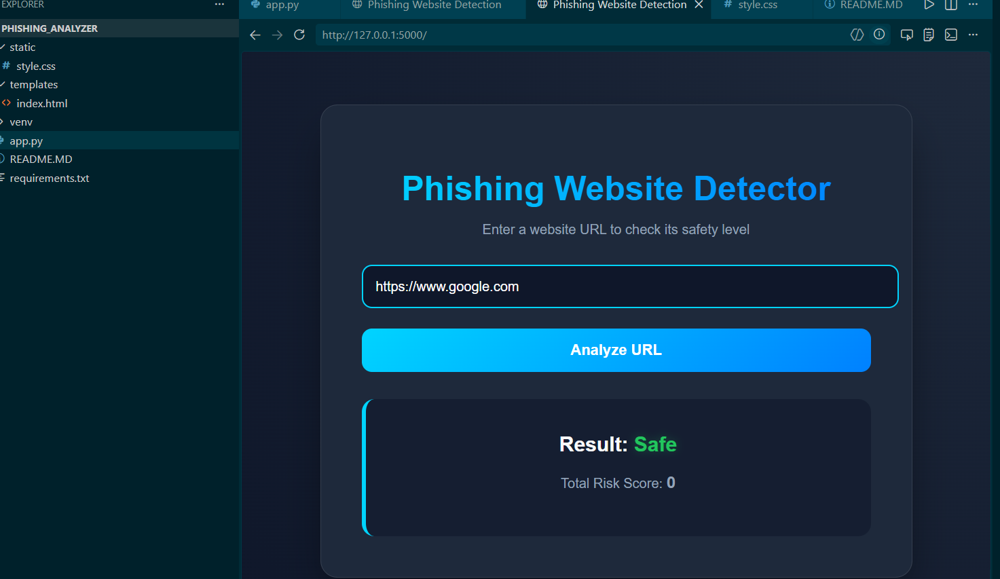
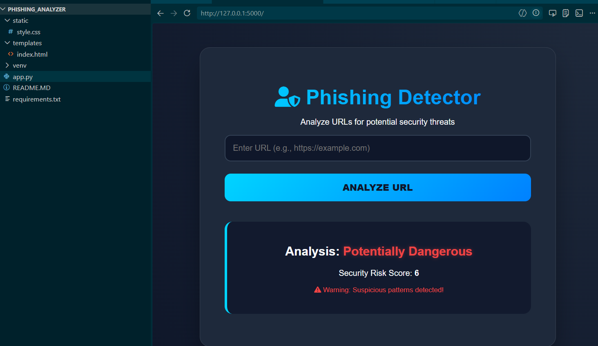

# Phishing Website Detection & URL Safety Analyzer

*Submitted By:* Sukhmanpreet Kaur (URN: 23303324)  
*Submitted To:* Dipika Sharma (Assistant Professor)  
*Institution:* Sardar Beant Singh State University, Gurdaspur  

---

## 1. Project Idea
This is a web-based application designed to analyze website URLs and determine whether they are safe or suspicious based on predefined security parameters.

## 2. Working Algorithm
The system evaluates a URL through the following security checks:
* *Protocol Check:* Identifies the presence of HTTPS.
* *Length Analysis:* Flags URLs longer than 75 characters as suspicious.
* *IP Address Detection:* Detects if an IP address is used instead of a domain name.
* *Keyword Detection:* Scans for suspicious words like "login", "bank", and "update".

## 3. Technology Stack
* *Language:* Python 3 (Backend)
* *Web Framework:* Flask (Backend Platform)
* *Frontend:* HTML5 and CSS3 (No JavaScript used)
* *Environment:* Python Virtual Environment (venv)

---

## 4. Features

- 🔒 HTTPS Protocol Detection
- 📏 URL Length Analysis
- 🌐 IP Address Detection in URLs
- 🚨 Suspicious Keyword Detection
- ⚡ Instant URL Classification
- 🎨 Simple and User-Friendly Interface

---

## 5. Screenshots

<p align="center">
  
</p>

### Safe URL Detection
<p align="center">
  
</p>

### Suspicious URL Detection
<p align="center">
  
</p>

---

## 5. How to Run
1. Open the terminal in VS Code.
2. Run the following commands in the terminal to setup and run the project:
   ```bash
   # Activate the virtual environment
   venv\Scripts\activate

   # Install Flask
   pip install flask

   # Run the application
   python app.py
3. Open your web browser and go to: http://127.0.0.1:5000
4. Enter a website URL and click *Analyze URL* to check whether the URL is safe or suspicious.
